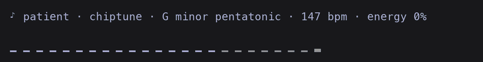

# codyssey

> [!IMPORTANT]
> Only tested on macOS. Not sure yet how it behaves on Linux or Windows.

I'm an engineer, but these days I solve the boring problems entirely by vibe coding. Somewhere along the way I felt I had lost the creativity and curiosity I used to have when writing code myself.

So I started thinking about how to make vibe coding fun again. codyssey turns a Claude Code session into a little adventure: while the agent does the work, you hear it as music, watch a pixel knight fight through it, and read it back as a quest log.

It's three mods in one place. Take the ones you like and leave the rest: [each one installs, turns on and turns off on its own](#pick-your-mods).

## What it is

Three Claude Code mods, each its own plugin in this marketplace.

### miod: the soundtrack

Generative music written on the spot while Claude works. No music files, no library, no AI model.

- Every task picks its own flavour (lo-fi, chiptune, ambient, jazzy and 8 more), key, chord progression, tempo, sound and theme.
- The mood follows what the agent is doing: reading sounds airy, editing bright, testing focused, shipping triumphant, failing tense until a command passes.
- The faster it spends tokens, the busier the music.
- Above the prompt, one line shows the mood, flavour, key, tempo and energy, with a wave under it that scrolls with the music:



### knightod: the hero

A pixel knight walks a narrow strip above the prompt while Claude works.

- Every tool call is an encounter: reading finds a scroll, editing a file fights its monster (slime, goblin, skeleton, orc, spider), web searches raise bats and ghosts, and subagents send a skeleton.
- A failed command costs a heart. A test that passes after a failure summons the Bug Dragon.
- Committing, pushing or opening a PR opens a treasure chest.
- Every two minutes of play a boss comes: King Slime, Ogre, Lich, Demon, then the Shadow King.
- Kills bring gold and xp, xp brings levels, and the game is saved when the task ends. The knight makes camp while you're away.

### scrollod: the quest log

Restyles the transcript so the story is easier to follow.

- Tool calls become one-liners, and their results show only when they fail.
- Claude's replies stand out from the tool noise.
- Two styles: **plain** (the default) and **game**, where each tool call wears a badge (☰ SCOUT, ⚒ FORGE, ⚔ FIGHT, ☄ MAGIC, ♞ ALLY, ⚗ POTION), Claude speaks from a nameplate, your prompts sit in a ◆ YOU box, and finished background tasks arrive as ⚑ QUEST rows.

## Install

Needs Claude Code 2.1.290 or newer, on macOS.

```bash
claude plugin marketplace add delexw/codyssey
claude plugin install miod@codyssey
claude plugin install knightod@codyssey
claude plugin install scrollod@codyssey
```

Install only the ones you want, then start a new session.

## Pick your mods

Each mod is its own plugin, so you choose which ones run:

- **Leave one out for good:** don't install it, or turn it off with `claude plugin disable knightod@codyssey` (and back on with `claude plugin enable knightod@codyssey`).
- **Pause one for now:** `/miod off`, `/knightod off` or `/scrollod off`, and `on` to bring it back. `/scrollod off` sticks across sessions; `/miod off` and `/knightod off` last for the session.
- **Game style:** scrollod starts plain. Turn the game style on with `/scrollod style game`; it stays on in later sessions until you pick `/scrollod style plain`.

## Usage

```
/miod                    is the music on or off?
/miod off                stop the music
/miod on                 play again from the next task
/miod wave               list the wave looks: bars, line, mirror, dots, pulse
/miod wave dots          switch the wave to the dots look

/knightod                the saved game: level, hearts, kills, gold, bosses
/knightod off            put the knight away
/knightod on             send the knight out again
/knightod reset          start over with a new knight

/scrollod                on or off, and which style
/scrollod off            show the transcript as Claude Code draws it
/scrollod on             restyle it again
/scrollod style game     badges, nameplates and quest rows
/scrollod style plain    back to the plain look
```

## Add your own

Each mod lives in `plugins/<name>/`.

- **miod:** each mood is one row in `plugins/miod/hooks/moods.ts`, each flavour one row in `hooks/flavours.ts`, each sound style one entry in `hooks/styles.ts`, and each wave look one file in `hooks/waves/`.
- **knightod:** monsters and bosses are sprites in `plugins/knightod/hooks/sprites/`; which tool raises which encounter is in `hooks/game/cues.ts`, and the boss order and timing in `hooks/game/bosses.ts`.
- **scrollod:** the game style's badges are in `plugins/scrollod/hooks/badge.ts`, and the styles in `hooks/style.ts`.

Then check it:

```sh
claude plugin validate .
claude plugin validate plugins/<name>
claude plugin test plugins/<name>
```

Run a checkout without installing it with `claude --plugin-dir plugins/<name>`.

## Limitations

- Only tested on macOS, where Claude Code plays miod's audio through `afplay`.
- miod's sound is simple chiptune-style tones.
- Each mod only sees the session it's loaded in.
- If you installed miod from `delexw/miod` before, uninstall that copy (`claude plugin uninstall miod@miod`) so `/miod` isn't registered twice.
