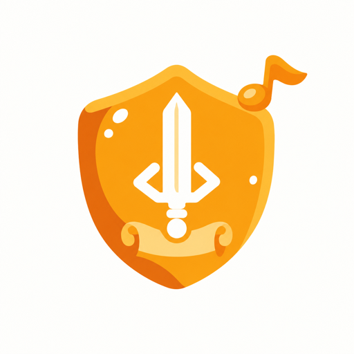
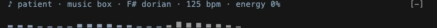
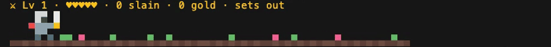
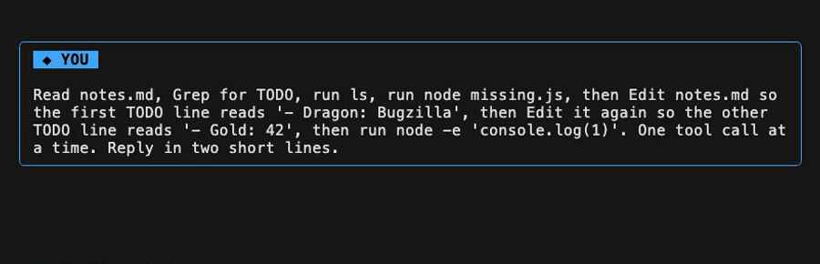

<p align="center">
  
</p>

<h1 align="center">codyssey</h1>

<p align="center">Claude Code, played as an adventure: soundtrack, hero and quest log.</p>

> [!IMPORTANT]
> miod's music only works on macOS.

I'm an engineer, but these days I solve the boring problems entirely by vibe coding. Somewhere along the way I felt I had lost the creativity and curiosity I used to have when writing code myself.

So I started thinking about how to make vibe coding fun again. codyssey turns a Claude Code session into a little adventure: while the agent does the work, you hear it as music, watch a pixel knight fight through it, and read it back as a quest log.

It's three mods in one plugin, and [each one turns on and off on its own](#pick-your-mods).

## What it is

Three Claude Code mods in one plugin.

### miod: the soundtrack

Generative music written on the spot while Claude works. No music files, no library, no AI model.

- Every task picks its own flavour (lo-fi, chiptune, ambient, jazzy and 8 more), key, chord progression, tempo, sound and theme.
- The mood follows what the agent is doing: reading sounds airy, editing bright, testing focused, shipping triumphant, failing tense until a command passes.
- The faster it spends tokens, the busier the music.
- Above the prompt, one line shows the mood, flavour, key, tempo and energy, with a wave under it that scrolls with the music:



### knightod: the hero

A pixel knight walks a narrow strip above the prompt while Claude works.

- Every tool call is an encounter: reading finds a scroll, editing a file fights its monster (slime, goblin, skeleton, orc, spider), web searches raise bats and ghosts, and subagents send a skeleton.
- A failed command costs a heart. A test that passes after a failure summons the Bug Dragon.
- Committing, pushing or opening a PR opens a treasure chest.
- Every two minutes of play a boss comes: King Slime, Ogre, Lich, Demon, then the Shadow King.
- Monsters and bosses grow tougher as the knight levels up.
- Kills bring gold and xp, and xp brings levels. Progress carries from task to task within a session; a new session starts a new knight. The knight makes camp while you're away.



What you can meet on the road:

| When Claude… | The knight meets | What it brings |
|---|---|---|
| Reads or searches files (Read, Grep, Glob) | A scroll | Heals 1 heart |
| Edits or writes a file | A Slime, Goblin, Skeleton, Orc or Spider (the file name picks which) | 1 xp and 1 to 3 gold, plus 1 xp and 1 gold for each extra heart |
| Searches or fetches the web | A Bat or Ghost | Same as any monster |
| Runs a command | A Goblin or Wolf | Same as any monster |
| Hands work to a subagent | A Skeleton | Same as any monster |
| Calls an MCP tool | A Slime | Same as any monster |
| Runs a command that fails | A hit | Loses 1 heart |
| Runs a passing test or check after a failure | The Bug Dragon, 4 hearts | 2 xp and 5 gold or more per heart |
| Commits, pushes, merges, tags, or opens or merges a PR | A treasure chest | 5 to 24 gold |
| Has been playing for 2, 4, 6, 8, then 10 minutes | King Slime (3 hearts), Ogre (4), Lich (5), Demon (6), Shadow King (7) | 2 xp and 5 gold or more per heart |

The knight picks a weapon at random for every strike:

| Weapon | Range | Power | How often | How it hits |
|---|---|---|---|---|
| Sword | Close | 1 heart | Often | A slash |
| Axe | Close | 2 hearts | Sometimes | A heavy chop |
| Lance | A little further | 1 heart | Sometimes | Reaches the monster a few steps early |
| Dagger | Far | 1 heart | Sometimes | Thrown early, flies to the monster |
| Fireball | Furthest | 2 hearts | Rarely | Cast from far off, flies to the monster |

Now and then a strike becomes a glowing sword special that takes 2 hearts. Each weapon is one file in `hooks/knightod/game/weapons/`, with its range, power and how often it's picked.

How the game works:

| Mechanism | How it works |
|---|---|
| Hearts | The knight starts with 5. Every monster and boss shows its hearts above it. |
| Monsters level up | Monsters start with 1 heart and gain one every 3 knight levels. Bosses gain one every 2 knight levels, on top of their own. |
| Levels | Each level needs 8 more xp than the last. A new level adds a heart and heals the knight fully. |
| Boss fights | A boss swings back and can wound the knight, but never lands the last blow. Some of the knight's strikes are specials that hit for 2. |
| Falling | Losing the last heart to a failed command brings the knight back with full hearts and half the gold. |
| Speed | The knight walks faster the quicker Claude spends tokens: normal, then double from 30k tokens a minute, then triple from 80k. |
| Progress | Level, hearts, kills, gold, quests, play time, bosses slain and falls add up from task to task, for the rest of the session. A new session starts a new knight. Between tasks the knight sits by a campfire. |
| Pausing | If Claude ends its turn while a background command or subagent is still running, the knight shows ⏸ paused and stays on the road. When the last one finishes, the knight makes camp. |

### scrollod: the quest log

Restyles the transcript so the story is easier to follow.

- Tool calls become one-liners, and their results show only when they fail.
- Claude's replies stand out from the tool noise.
- Two styles: **plain** (the default) and **game**, where each tool call wears a badge (☰ SCOUT, ⚒ FORGE, ⚔ FIGHT, ☄ MAGIC, ♞ ALLY, ⚗ POTION), Claude speaks from a nameplate, your prompts sit in a ◆ YOU box, and finished background tasks arrive as ⚑ QUEST rows.



## Install

Needs Claude Code 2.1.290 or newer.

```bash
claude plugin marketplace add delexw/codyssey
claude plugin install codyssey@codyssey
```

Then start a new session. All three mods start on.

If you loaded miod, knightod or scrollod on their own before (from `delexw/miod`, or a folder in `CLAUDE_CODE_PLUGIN_DIRS`), remove those first, or their commands are registered twice.

## Pick your mods

All three come in the one plugin, and each turns on and off with its own command:

- **Turn one off:** `/miod off`, `/knightod off` or `/scrollod off`, and `on` to bring it back. The choice is remembered in later sessions.
- **Game style:** scrollod starts plain. Turn the game style on with `/scrollod style game`; it stays on in later sessions until you pick `/scrollod style plain`.

## Usage

```
/miod                    is the music on or off?
/miod off                stop the music
/miod on                 play again from the next task
/miod wave               list the wave looks: bars, line, mirror, dots, pulse
/miod wave dots          switch the wave to the dots look

/knightod                this session's game: level, hearts, kills, gold, bosses
/knightod off            put the knight away
/knightod on             send the knight out again
/knightod reset          start over with a new knight

/scrollod                on or off, and which style
/scrollod off            show the transcript as Claude Code draws it
/scrollod on             restyle it again
/scrollod style game     badges, nameplates and quest rows
/scrollod style plain    back to the plain look
```

## Add your own

Each mod lives in its own folder under `hooks/`, and `hooks/register.tsx` turns all three on.

- **miod:** each mood is one row in `hooks/miod/moods.ts`, each flavour one row in `hooks/miod/flavours.ts`, each sound style one entry in `hooks/miod/styles.ts`, and each wave look one file in `hooks/miod/waves/`.
- **knightod:** each weapon is one file in `hooks/knightod/game/weapons/`; monsters and bosses are sprites in `hooks/knightod/sprites/`; which tool raises which encounter is in `hooks/knightod/game/cues.ts`, and the boss order and timing in `hooks/knightod/game/bosses.ts`.
- **scrollod:** the game style's badges are in `hooks/scrollod/badge.ts`, and the styles in `hooks/scrollod/style.ts`.

Then check it:

```sh
claude plugin validate .
claude plugin test .
```

Run a checkout without installing it with `claude --plugin-dir <path to this repo>`.

## Limitations

- miod's music only plays on macOS, where Claude Code plays it through `afplay`.
- miod's sound is simple chiptune-style tones.
- codyssey only sees the session it's loaded in.
